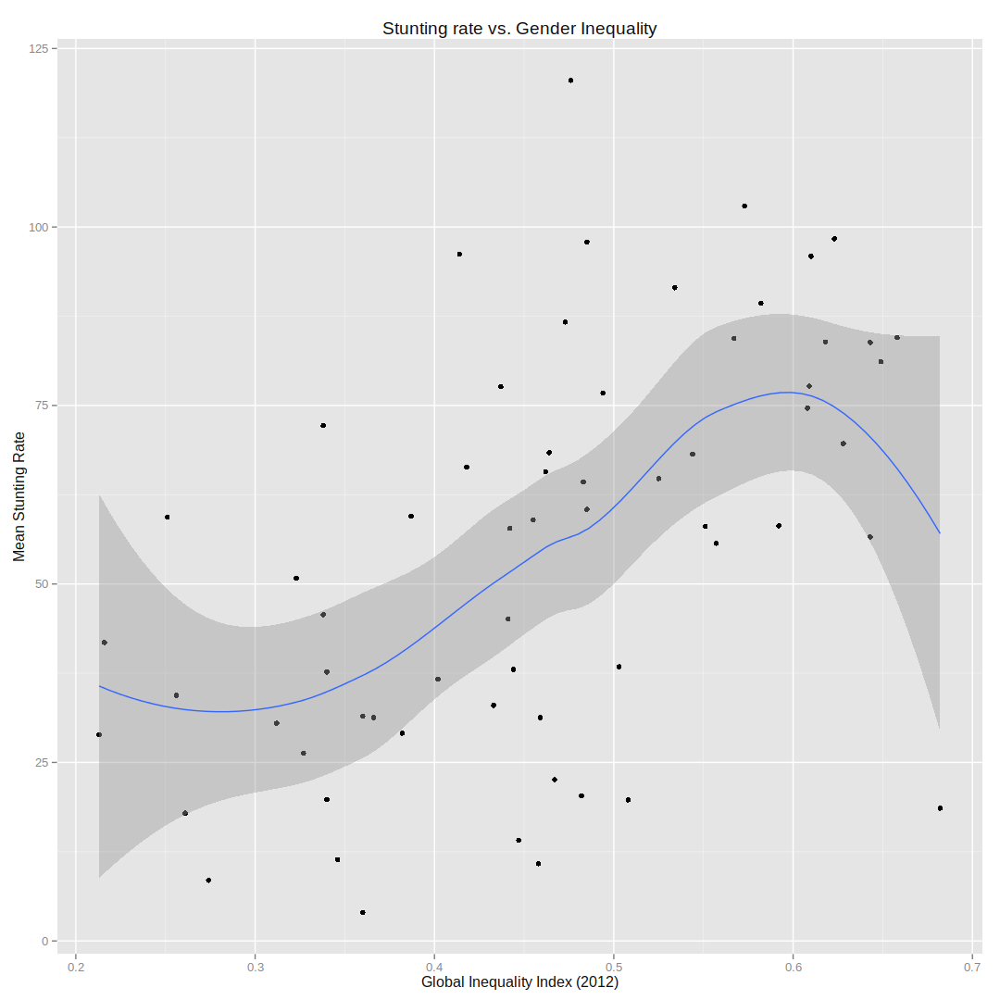

---
output:
  knitrBootstrap::bootstrap_document:
    title: "Bread for the World: Women's Empowerment and Nutrition"
    theme: flatly
---


Bread for the World Hackathon: Women's Empowerment & Nutrition
==============================================================

Overview
--------

This analysis was put together for the [HelpMeViz](http://helpmeviz.com/)
[hackathon on Women's Empowerment &
Nutrition](http://helpmeviz.com/2014/06/28/hackathon-womens-empowerment-nutrition/)
which took place at the [Bread for the World
Institute](http://www.bread.org/institute/) on Saturday, June 28, 2014. The
purpose of the hackathon was to explore the relationship between the status of
Women in various countries and child nutrition and stunting. This is one part
of two separate visualization challenges addressed in the hackathon.

From the HelpMeViz description:

> As we begin to explore years of data on women’s empowerment from the World
> Bank and United Nations, we want to ask the question: Do countries that
> significantly improve the status of women also see lower rates of stunting?
> Women are the primary caregivers in the family. Research from countries
> around the world has shown that when women are empowered to earn more and
> have a greater say in home finances, they are more likely than men to invest
> the additional money in promoting the welfare of their children — through
> nutritious food, for example. In this project, Bread for the World Institute
> is interested in exploring whether and where women’s empowerment is
> associated with improvements in stunting and, if so, over what period of
> time. The answer to the question of whether the two indicators coincide is
> most likely to be "sometimes yes, sometimes no."

For more information on the goals of the visualization challenge, see:

* [HelpMeViz: Women's Empowerment &
  Nutrition](http://helpmeviz.com/2014/06/28/hackathon-womens-empowerment-nutrition/)
* [Bread for the World](http://www.bread.org/institute/)

Data Sources
------------

The data used for this analysis comes from several sources:

1. [The association of maternal age with infant mortality, child anthropometric
   failure, diarrhoea and anaemia for first births: evidence from 55 low- and
   middle-income countries (Finlay et al. 2011)](http://bmjopen.bmj.com/content/1/2/e000226.full)
2. [Women’s empowerment and nutrition: An evidence review
   (2013)](http://www.ifpri.org/publication/women-s-empowerment-and-nutrition)
3. [USAID: Women's Lives and Challenges: Equality and Empowerment since 2000
   (2014)](http://www.usaid.gov/news-information/press-releases/mar-7-2014-usaid-release-womens-lives-and-challenges-report)
4. [Hunger and Nutrition Commitment Index](http://www.hancindex.org/)
5. [The State of the World's
   Children (2014)](http://www.unicef.org/sowc2014/numbers/#statistics)
6. [GII: Gender Inequality Index over
   time](https://data.undp.org/dataset/GII-Gender-Inequality-Index-value/bh77-rzbn)

Some relevant tables from each of the above reports have been compiled into CSV
and excel spreadsheets and made available for the hackathon. The CSV versions
of those tables are included in the `input` folder.

A table containing country/region mappings was downloaded from:

* [https://github.com/okfn/iatitools/](https://github.com/okfn/iatitools/blob/master/mapping/ISO-DAC-Countries-Regions.csv)


Data preparation
----------------

### Clean up stunting data


```r
library(dplyr)
options(StringsAsFactors=FALSE)

# Load stunting data
stunting = tbl_df(read.csv('input/World Bank Stunting and Wasting Data, by gender.csv'))
                           
# Grab data for the last 15 years
stunting = stunting %>% select(Country.Name, Country.Code, Indicator.Code, 
                               X2000, X2001, X2002, X2003, X2004, X2005, X2006,
                               X2007, X2008, X2009, X2010, X2011, X2012, X2013)

# Mean stunting for last 15 years
values = stunting  %>% select(-Country.Name, -Country.Code, -Indicator.Code)
stunting$Mean.Stunting = apply(values, 1, function(x) { mean(x, na.rm=T) })

# Most recent data point for each Country for which data is available during
# this time period
stunting$Most.Recent.Stunting = as.numeric(apply(values, 1, function(x) {
                                                 tail(x[!is.na(x)], 1) }))

# Drop the individual year columns
stunting = stunting %>% select(Country.Name, Country.Code, Indicator.Code,
                               Mean.Stunting, Most.Recent.Stunting)

# Drop Countries with no recent data
stunting = stunting %>% filter(!is.nan(Mean.Stunting))

# Male vs. Female Stunting
male_stunting = stunting %>% filter(Indicator.Code == 'SH.STA.STNT.MA.ZS')
female_stunting = stunting %>% filter(Indicator.Code == 'SH.STA.STNT.FE.ZS')

# Save output
write.csv(male_stunting, file='output/male_stunting.csv', row.names=FALSE)
write.csv(female_stunting, file='output/female_stunting.csv', row.names=FALSE)
```

### Combined dataset

The mean stunting rates for male and female from above were combined with
predictor variables from other datasets into a single file to make it easier to
visualize. Let's now load that complete dataset and see what we can find.

#### Data fields

The fields contained in the dataset `Stunting3.csv` include:

* Country name
* 2012 Seats in National Parliament (% female)
* 2010 Maternal Mortality Ratio
* Adolescent Fertility Rate
* 2006-2010 Population with at least secondary education (Female)
* 2006-2010 Population with at least secondary education (Male)
* 2011 Labour force participation rate (Female)
* 2011 Labour force participation rate (Male)
* 2010 Global Inequality Index (GII)
* 2012 Global Inequality Index (GII)
* 2013 Global Hunger Index (IFPRI)
* 2011 Under-five Mortality rate (IFPRI)
* 2010-2012 Prevalence of undernourishment in the population (IFPRI)
* 2008-2012 Prevalence of underweight in children under five years (IFPRI)
* Expr1024 (?)
* Percent children with stunting (Female)
* Percent children with stunting (Female)


```r
# load cleaned data
df = tbl_df(read.csv('input/Stunting4.csv'))

# let's make names easy to type..
colnames(df) = c("country", "seats_parlim_female", "maternal_mortality_ratio",
                 "adolescent_fertility_rate", "secondary_education_female",
                 "secondary_education_male", "labor_participation_female",
                 "labor_participation_male", "GII_2010", "GII_2012",
                 "ifpri_hunger_index", "ifpri_under5_mortality",
                 "ifpri_undernourishment", "ifpri_under5_underweight",
                 "Expr1024", "mean_stunting_female", "mean_stunting_male")

# create a combined column
df = df %>% mutate(mean_stunting_all = mean_stunting_female + mean_stunting_male)

# create a version which includes only those countries that have all data
# fields populated
df_complete = df[complete.cases(df),]
```

Visualization
-------------

### How do the predictors relate to one another? (In progress...)

Let's start by exploring the relationship between the various predictors and
our outcome of interest; rate of stunting. Below, a data-dimension reduction
tool called a [biplot](http://en.wikipedia.org/wiki/Biplot) is used for this.


```r
library(bpca)

plot(bpca(df_complete[-1]),
     var.factor=.5,
     obj.names=TRUE,
     obj.labels=df_complete$country)
```

 

### Mean Stunting Rate vs. Global Inequality Index


```r
library(ggplot2)

ggplot(df, aes(GII_2012, mean_stunting_all)) + geom_point() + geom_smooth() +
    xlab('Global Inequality Index (2012)') +
    ylab('Mean Stunting Rate') + 
    ggtitle('Stunting rate vs. Gender Inequality')
```

```
## geom_smooth: method="auto" and size of largest group is <1000, so using loess. Use 'method = x' to change the smoothing method.
```

```
## Warning: Removed 10 rows containing missing values (stat_smooth).
## Warning: Removed 10 rows containing missing values (geom_point).
```

 

System Information
------------------


```r
sessionInfo()
```

```
## R version 3.1.0 (2014-04-10)
## Platform: x86_64-unknown-linux-gnu (64-bit)
## 
## locale:
##  [1] LC_CTYPE=en_US.UTF-8       LC_NUMERIC=C              
##  [3] LC_TIME=en_US.UTF-8        LC_COLLATE=en_US.UTF-8    
##  [5] LC_MONETARY=en_US.UTF-8    LC_MESSAGES=en_US.UTF-8   
##  [7] LC_PAPER=en_US.UTF-8       LC_NAME=C                 
##  [9] LC_ADDRESS=C               LC_TELEPHONE=C            
## [11] LC_MEASUREMENT=en_US.UTF-8 LC_IDENTIFICATION=C       
## 
## attached base packages:
## [1] stats     graphics  grDevices utils     datasets  methods   base     
## 
## other attached packages:
##  [1] bpca_1.2-2           rgl_0.93.996         scatterplot3d_0.3-35
##  [4] ggplot2_1.0.0        dplyr_0.2            knitr_1.6.5         
##  [7] rmarkdown_0.2.49     knitrBootstrap_1.0.0 vimcom.plus_1.0-0   
## [10] setwidth_1.0-3       colorout_1.0-3      
## 
## loaded via a namespace (and not attached):
##  [1] assertthat_0.1   colorspace_1.2-4 digest_0.6.4     evaluate_0.5.5  
##  [5] formatR_0.10     grid_3.1.0       gtable_0.1.2     htmltools_0.2.4 
##  [9] labeling_0.2     magrittr_1.0.1   markdown_0.7     MASS_7.3-31     
## [13] mime_0.1.1       munsell_0.4.2    parallel_3.1.0   plyr_1.8.1      
## [17] proto_0.3-10     Rcpp_0.11.1      reshape2_1.4     scales_0.2.4    
## [21] stringr_0.6.2    tools_3.1.0      yaml_2.1.11
```

