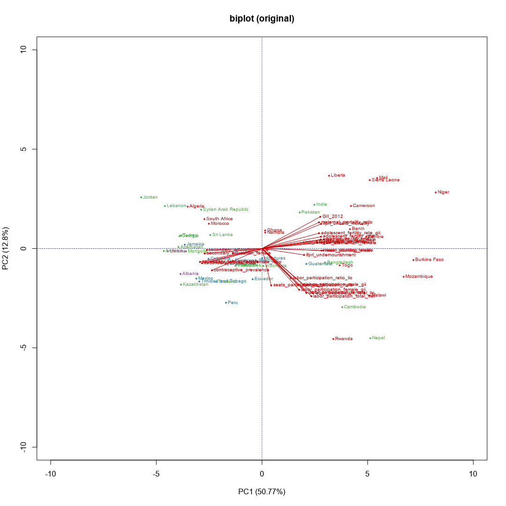
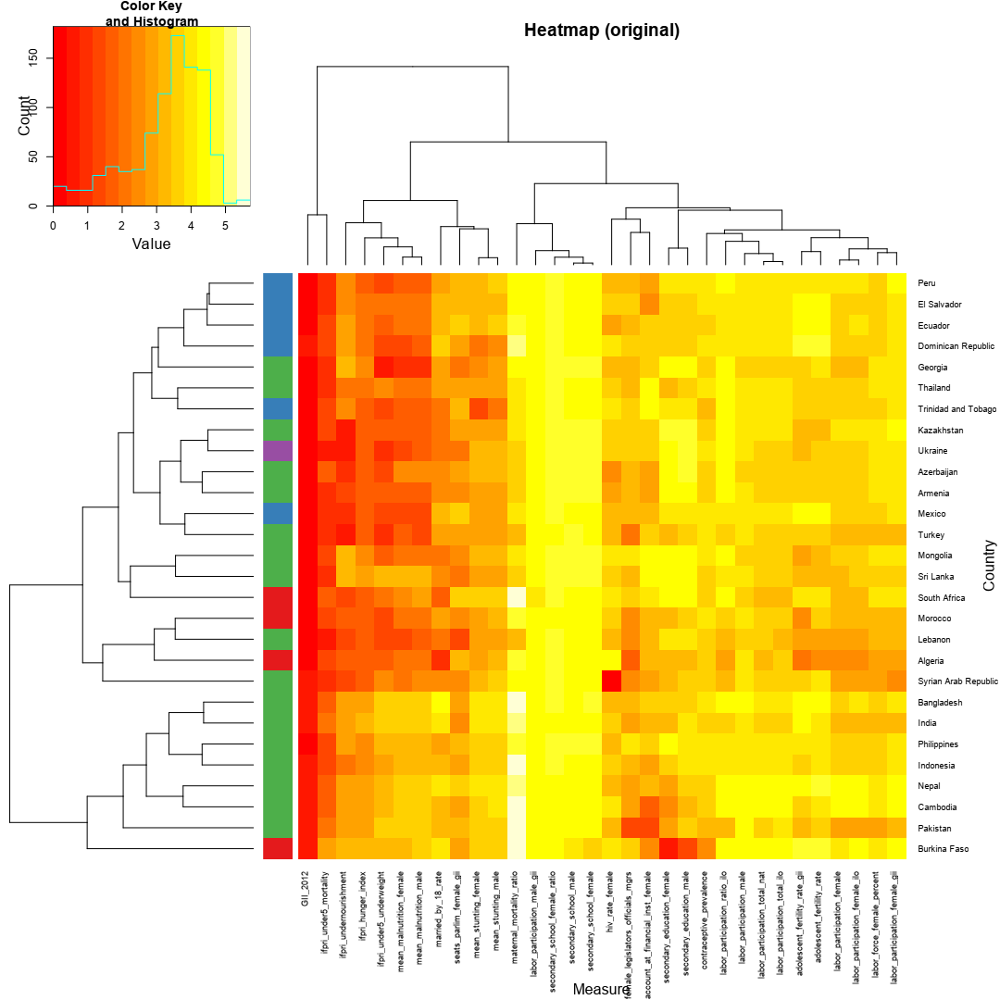
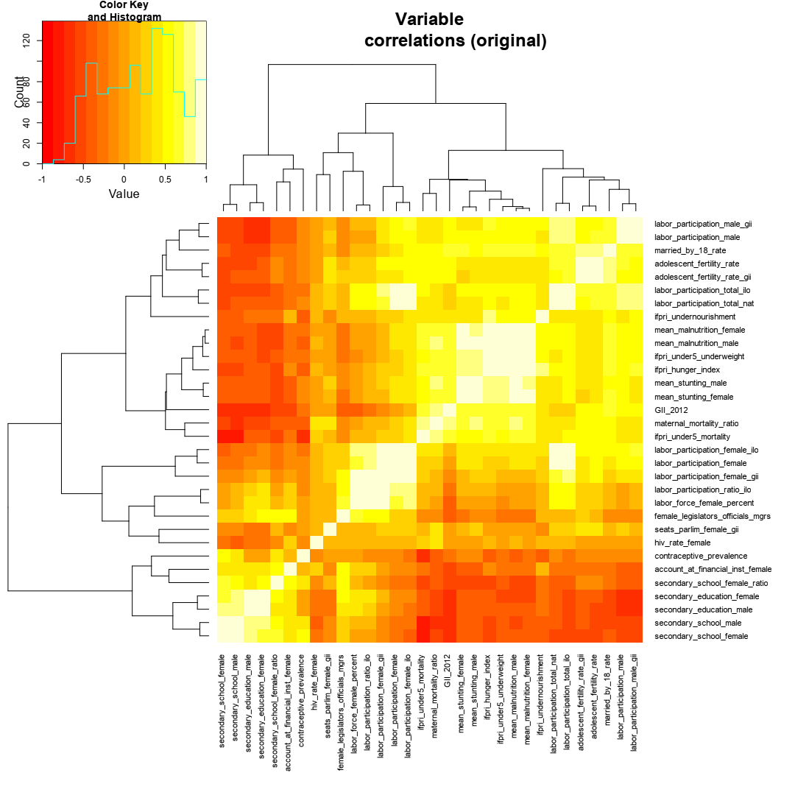
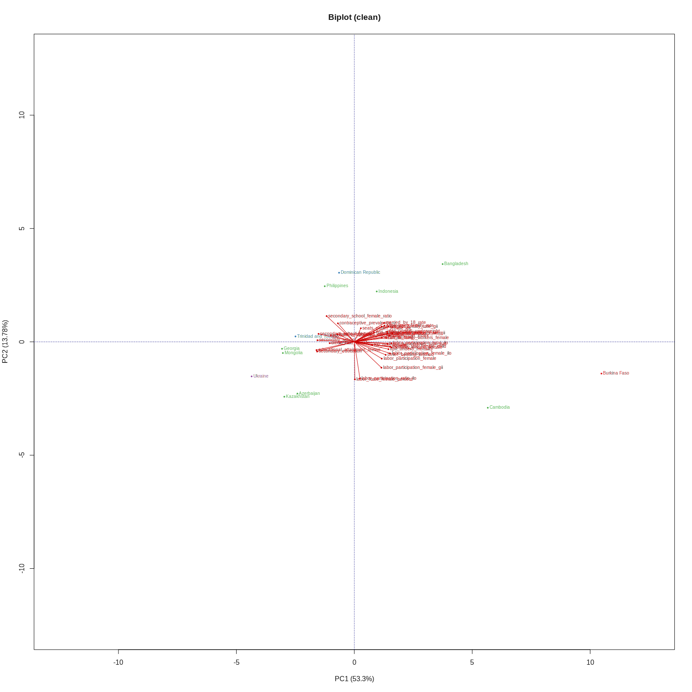
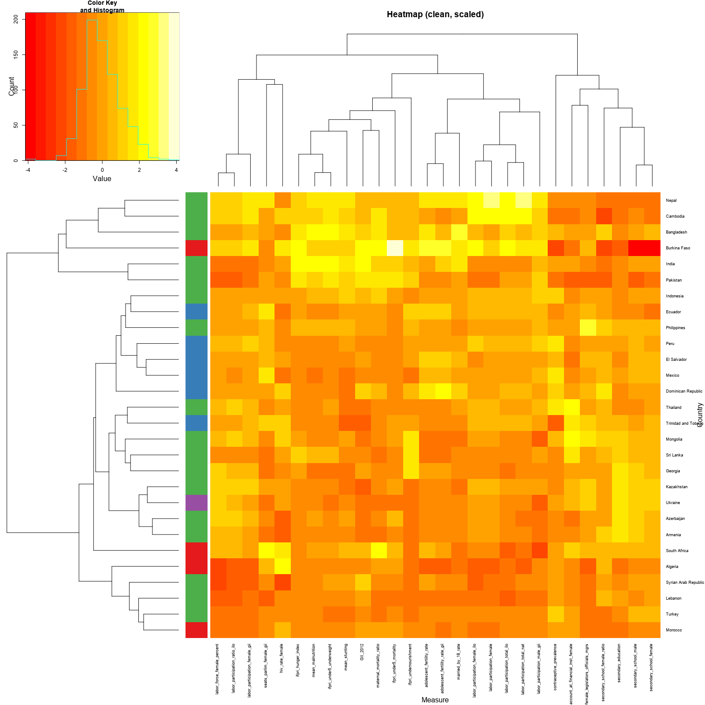
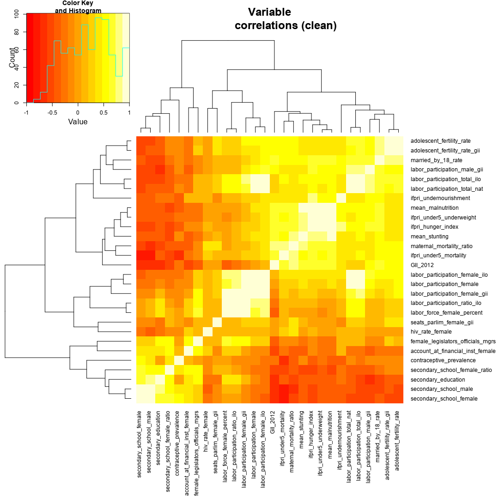
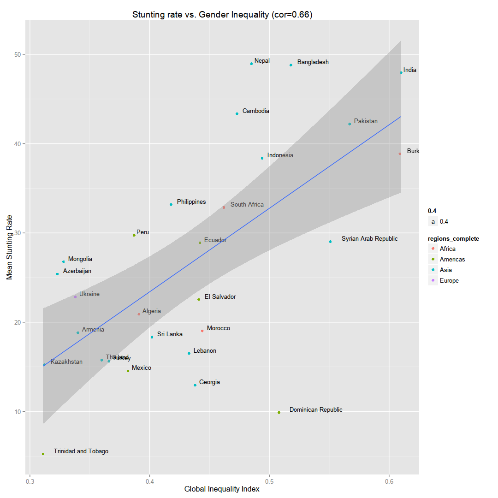
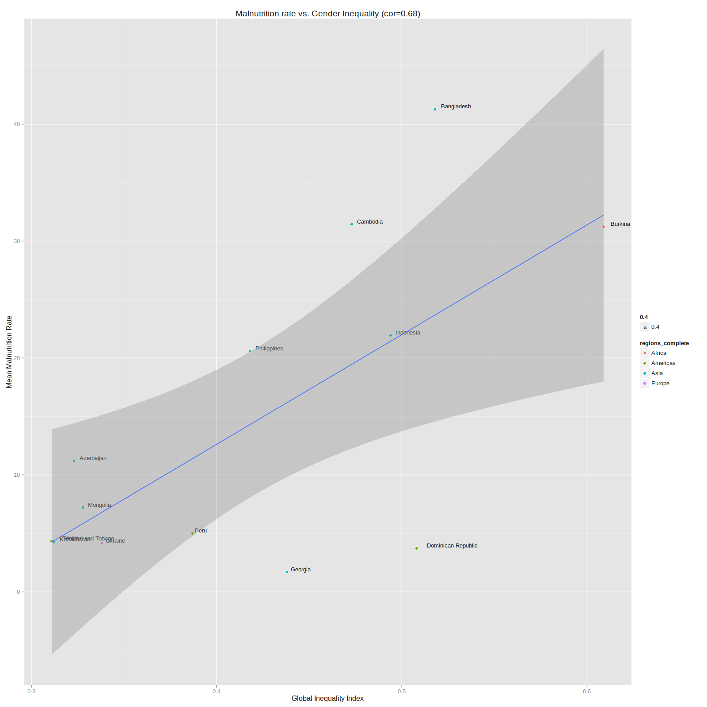
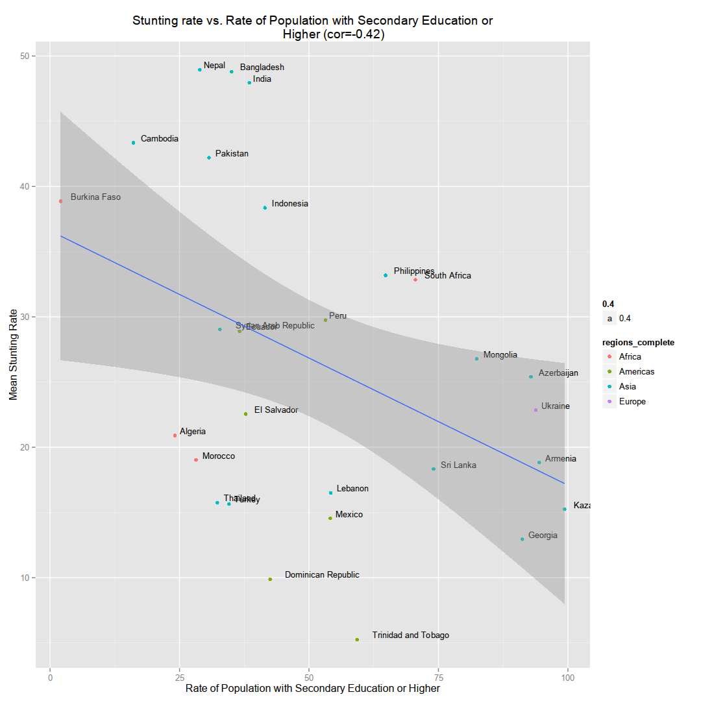
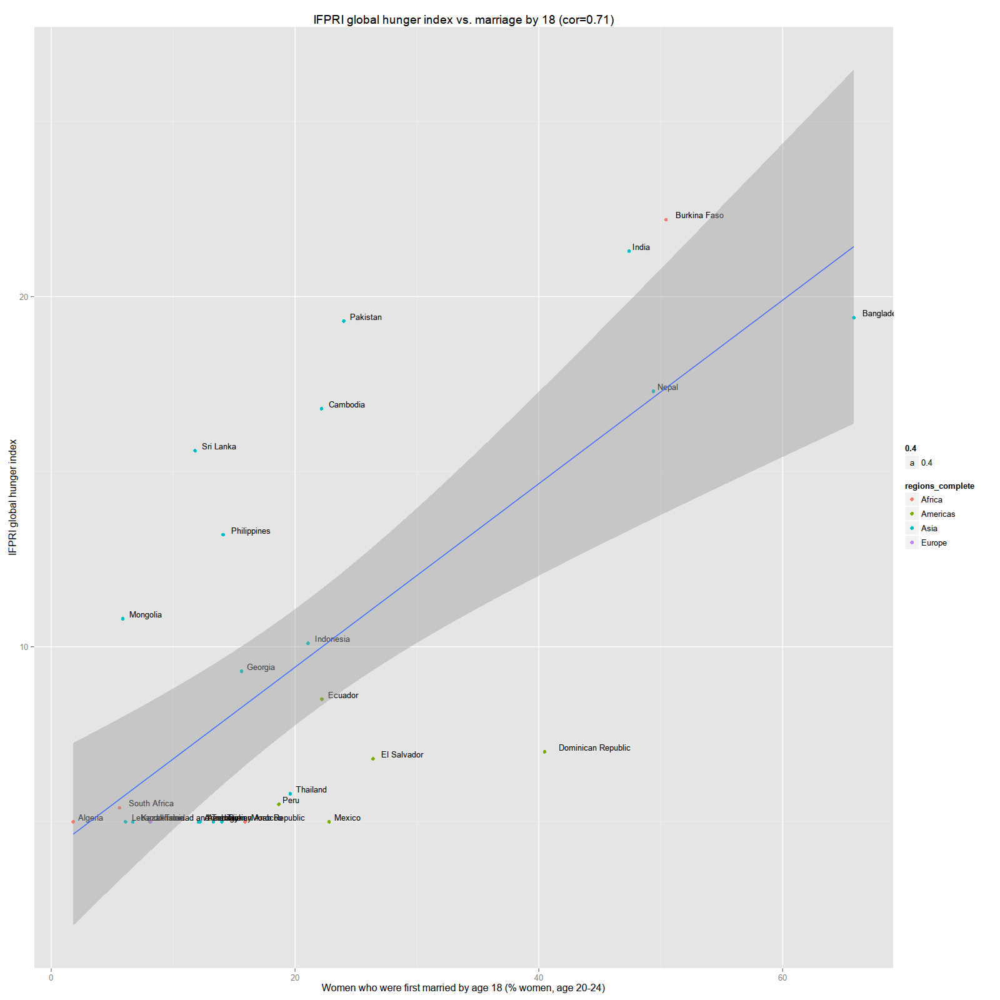

Bread for the World Hackathon: Women's Empowerment & Nutrition
==============================================================

<a href='mailto:khughitt@umd.edu'>Keith Hughitt</a> (<time>2014-09-28</time>) [view source](README.rmd)

Introduction
------------

### Overview

This analysis was put together for the [HelpMeViz](http://helpmeviz.com/) [hackathon on Women's Empowerment & Nutrition](http://helpmeviz.com/2014/06/28/hackathon-womens-empowerment-nutrition/) which took place at the [Bread for the World Institute](http://www.bread.org/institute/) on Saturday, June 28, 2014. The purpose of the hackathon was to explore the relationship between the status of Women in various countries and child nutrition and stunting. This is one part of two separate visualization challenges addressed in the hackathon.

From the HelpMeViz description:

> As we begin to explore years of data on women’s empowerment from the World Bank and United Nations, we want to ask the question: Do countries that significantly improve the status of women also see lower rates of stunting? Women are the primary caregivers in the family. Research from countries around the world has shown that when women are empowered to earn more and have a greater say in home finances, they are more likely than men to invest the additional money in promoting the welfare of their children — through nutritious food, for example. In this project, Bread for the World Institute is interested in exploring whether and where women’s empowerment is associated with improvements in stunting and, if so, over what period of time. The answer to the question of whether the two indicators coincide is most likely to be "sometimes yes, sometimes no."

For more information on the goals of the visualization challenge, see:

-   [HelpMeViz: Women's Empowerment & Nutrition](http://helpmeviz.com/2014/06/28/hackathon-womens-empowerment-nutrition/)
-   [Bread for the World](http://www.bread.org/institute/)

### Reading this document

This document and the analysis herein was generated using the [R programming language](http://www.r-project.org/) and the [knitr](http://yihui.name/knitr/) report generation package.

If you are interested in understanding more about the code in this analysis, or how the output was generated, below are a few tutorials to get you started:

1.  [Getting started with R](https://support.rstudio.com/hc/en-us/articles/201141096-Getting-Started-with-R)
2.  [Introduction to dplyr](http://cran.rstudio.com/web/packages/dplyr/vignettes/introduction.html)
3.  [Basic introduction to ggplot2](http://www.ancienteco.com/2012/03/basic-introduction-to-ggplot2.html)
4.  [Markdown basics](https://daringfireball.net/projects/markdown/basics)
5.  [Knitr in a knutshell](http://kbroman.github.io/knitr_knutshell/)

Data Sources
------------

The data used for this analysis comes from several sources:

1.  [The association of maternal age with infant mortality, child anthropometric failure, diarrhoea and anaemia for first births: evidence from 55 low- and middle-income countries (Finlay et al. 2011)](http://bmjopen.bmj.com/content/1/2/e000226.full)
2.  [Women’s empowerment and nutrition: An evidence review (2013)](http://www.ifpri.org/publication/women-s-empowerment-and-nutrition)
3.  [USAID: Women's Lives and Challenges: Equality and Empowerment since 2000 (2014)](http://www.usaid.gov/news-information/press-releases/mar-7-2014-usaid-release-womens-lives-and-challenges-report)
4.  [Hunger and Nutrition Commitment Index](http://www.hancindex.org/)
5.  [The State of the World's Children (2014)](http://www.unicef.org/sowc2014/numbers/#statistics)
6.  [GII: Gender Inequality Index over time](https://data.undp.org/dataset/GII-Gender-Inequality-Index-value/bh77-rzbn)
7.  [The World Bank: Child Malnutrition Estimates](http://data.worldbank.org/child-malnutrition)

Some relevant tables from each of the above reports have been compiled into CSV and excel spreadsheets and made available for the hackathon. The CSV versions of those tables are included in the `input` folder.

A table containing country/region mappings was downloaded from:

-   [<https://github.com/lukes/>](https://github.com/lukes/ISO-3166-Countries-with-Regional-Codes/blob/master/all/all.csv)

Finally, a mapping from region codes to region names was retrieved from:

-   [<https://github.com/nexgenta/geo/>](https://github.com/nexgenta/geo/blob/master/data/00-georegion.csv)

Data preparation
----------------

### Overview

During the Hackathon, the mean stunting rates for male and female were combined with predictor variables from other datasets into a single file to make it easier to work with. The most recent version of this file is the called `Stunting4.csv` and can be found in the `input/` directory. To make things as transparent as possible, the same dataset is recreated below using the orignal datasources.

Other changes from the original Hackathon dataset:

1.  The `GII 2010` indicator has been dropped (it is very similar to the 2012 values and doesn't likely tell us anything new)
2.  Some additional data fields have been included, per follow-up discussions with The Bread for the World Institute

### Load Gender Inequality Indices

``` {.r}
library(dplyr)
options(StringsAsFactors=FALSE)

# Load gender inequality data
gii_cols = c(
    "hdi_rank", "country", "GII_2012", "maternal_mortality_ratio",
    "adolescent_fertility_rate_gii", "seats_parlim_female_gii",
    "seats_parlim_female_note", "secondary_education_female",
    "secondary_education_female_note", "secondary_education_male",
    "secondary_education_male_note", "labor_participation_female_gii",
    "labor_participation_male_gii"
)
dat = tbl_df(read.csv('input/Gender_Inequality_Index.csv', col.names=gii_cols,
                     na.strings='..'))

# Drop unneeded fields
dat = dat %>% select(-hdi_rank, -seats_parlim_female_note,
                     -secondary_education_female_note,
                     -secondary_education_male_note)
```

### Load International Food Policy Research Institute (IFPRI) data

``` {.r}
# Data is in a "long" format (http://www.r-bloggers.com/reshape-package-in-r-long-data-format-to-wide-back-to-long-again/)
# For now, we will just extract a few fields of interest and save them as
# separate columns. Eventually it may be worthwhile revisiting this dataset
# and incorporating other time points.
ifpri = tbl_df(read.csv('input/IFPRI_Global_Hunger_Index_data_clean.csv'))
ifpri$Country = as.character(ifpri$Country)

# Normalize country names
# TODO: Both of these should probably be mapped to the ISO-3166 naming
# standards
country_mapping = data.frame(t(matrix(c(
    'Bolivia',              'Bolivia (Plurinational State of)',
    'Bosnia & Herzegovina', 'Bosnia and Herzegovina',
    'Central African Rep.', 'Central African Republic',
    'Congo, Dem. Rep.',     'Congo (Democratic Republic of the)',
    'Congo, Rep.',          'Congo',
    'Egypt, Arab Rep.',     'Egypt',
    'Gambia, The',          'Gambia',
    'Iran, Islamic Rep.',   'Iran (Islamic Republic of)',
    'Kyrgyz Republic',      'Kyrgyzstan',
    'Lao PDR',              'Lao People\'s Democratic Republic',
    'Macedonia, FYR',       'The former Yugoslav Republic of Macedonia',
    'Moldova',              'Moldova (Republic of)',
    'North Korea',          'Korea (Democratic People\'s Rep. of)',
    'Slovak Republic',      'Slovakia',
    'Sudan (former)',       'Sudan',
    'Tanzania',             'Tanzania (United Republic of)',
    'Trinidad & Tobago',    'Trinidad and Tobago',
    'Venezuela, RB',        'Venezuela (Bolivarian Republic of)',
    'Vietnam',              'Viet Nam',
    'Yemen, Rep.',          'Yemen'
), nrow=2)))

names(country_mapping) = c('ifpri', 'gii')

# Replace IFPRI country names
diffnames = ifpri$Country %in% country_mapping$ifpri

ifpri[diffnames,'Country'] =
    as.character(country_mapping$gii[match(ifpri[diffnames,'Country'],
                                           country_mapping$ifpri)])

# 2013 Hunger index
ifpri_dat = ifpri %>%
    filter(Indicator == '2013 Global Hunger Index' & Year == 2013) %>%
    select(Country, Data)
colnames(ifpri_dat) = c('country', 'ifpri_hunger_index')

# Under-five mortality rate
ifpri_dat$ifpri_under5_mortality = (ifpri %>%
    filter(Indicator == 'Under-five Mortality rate  (%)' & Year == 2011))$Data

# Prevalence of undernourishment in the population
ifpri_dat$ifpri_undernourishment = (ifpri %>%
    filter(Indicator == 'Prevalence of undernourishment in the population  (%)'
         & Year == '2010-12'))$Data

# Prevalence of underweight in children under five years
ifpri_dat$ifpri_under5_underweight = (ifpri %>%
    filter(Indicator == 'Prevalence of underweight in children under five years  (%)'
         & Year == '2008-12'))$Data

# Add to main dataset
dat = merge(dat, ifpri_dat, by='country')
```

### Load World Bank Stunting and Malnutrition data

``` {.r}
# Load world bank data
wb_nutrition = tbl_df(read.csv('input/World Bank Stunting and Wasting Data, by gender.csv'))

# Grab data for the last 15 years
wb_nutrition = wb_nutrition %>% select(Country.Name, Country.Code, 
                                       Indicator.Code, X2000, X2001, X2002, 
                                       X2003, X2004, X2005, X2006,   X2007, 
                                       X2008, X2009, X2010, X2011, X2012, X2013)

# Compute averages of each indicator for past 15 years
values = wb_nutrition %>% select(-Country.Name, -Country.Code, -Indicator.Code)
wb_nutrition$mean = apply(values, 1, function(x) { mean(x, na.rm=T) })

# Drop Countries with no recent data
wb_nutrition = wb_nutrition %>% filter(!is.nan(mean))

# Most recent data point for each Country for which data is available during
# this time period
wb_nutrition$most_recent = as.numeric(apply(wb_nutrition %>% select(-mean), 1, 
                                        function(x) { tail(x[!is.na(x)], 1) }))

# Drop the individual year columns
wb_nutrition = wb_nutrition %>% select(Country.Name, Country.Code, 
                                       Indicator.Code, mean, most_recent)

# Male vs. Female Stunting (height)
male_stunting = wb_nutrition %>% filter(Indicator.Code == 'SH.STA.STNT.MA.ZS')
female_stunting = wb_nutrition %>% filter(Indicator.Code == 'SH.STA.STNT.FE.ZS')

# Male vs. Female Malnutrition (weight)
male_malnutrition = wb_nutrition %>% filter(Indicator.Code == 'SH.STA.MALN.MA.ZS')
female_malnutrition = wb_nutrition %>% filter(Indicator.Code == 'SH.STA.MALN.FE.ZS')

world_bank_nutrition_dat = data.frame(
    country                  = male_stunting$Country.Name,
    mean_stunting_male       = male_stunting$mean,
    mean_stunting_female     = female_stunting$mean,
    mean_malnutrition_male   = male_malnutrition$mean,
    mean_malnutrition_female = female_malnutrition$mean
)

# Add world bank data to main data frame
dat = merge(dat, world_bank_nutrition_dat, by='country')
```

### Load World Bank Gender Data

Next, we will load some indicators relating to women's status in various countries. The variables we will use are:

**Economic**

-   Labour force participation rates for 15-24, female (% ages 15-24) (national estimate)
-   Labour force participation rates for 15-24, male (% ages 15-24) (national estimate)
-   Labour force participation rates for 15-24, total (% of ages 15-24) (modeled ILO estimate)
-   Labour force participation rates for 15-24, total (% of ages 15-24) (national estimate)
-   Ratio of female to male labor force participation rate (%) (modeled ILO estimate)

**Education**

-   Progression to secondary school, female (%)
-   Progression to secondary school, male (%)
-   Ratio of female to male secondary enrollment (%)

**Health** - Contraceptive prevalence (% of women ages 15-49) - Female adults with HIV (% of population ages 15+ with HIV)

**Human Rights** - Proportion of women aged 15-49 subjected to physical or sexual violence in the last 12 months by an intimate partner (%) - Women who were first married by age 18 (% of women ages 20-24) - Adolescent fertility rate (births per 1,000 women ages 15-19)

``` {.r}
# Load world bank data
wb_gender = tbl_df(read.csv('input/World Bank Gender Stat Indicators (1990-2013).csv'))

# Grab data for the last 15 years
wb_gender = wb_gender %>% select(Country.Name,
                                 Indicator.Name, X2000, X2001, X2002, 
                                 X2003, X2004, X2005, X2006,   X2007, 
                                 X2008, X2009, X2010, X2011, X2012, X2013)

# Compute averages of each indicator for past 15 years
values = wb_gender %>% select(-Country.Name, -Indicator.Name)
wb_gender$mean = apply(values, 1, function(x) { mean(x, na.rm=T) })

# Drop Countries with no recent data
#wb_gender = wb_gender %>% filter(!is.nan(mean))

# Drop the individual year columns
wb_gender = wb_gender %>% select(Country.Name, Indicator.Name, mean)

# Add gender variables to the main dataframe
labor_participation_female    = wb_gender %>% filter(Indicator.Name == 'Labour force participation rates for 15-24, female (% ages 15-24) (national estimate)')
labor_participation_male      = wb_gender %>% filter(Indicator.Name == 'Labour force participation rates for 15-24, male (% ages 15-24) (national estimate)')
labor_participation_total_ilo = wb_gender %>% filter(Indicator.Name == 'Labour force participation rates for 15-24, total (% of ages 15-24) (modeled ILO estimate)')
labor_participation_total_nat = wb_gender %>% filter(Indicator.Name == 'Labour force participation rates for 15-24, total (% of ages 15-24) (national estimate)')
labor_participation_ratio_ilo = wb_gender %>% filter(Indicator.Name == 'Ratio of female to male labor force participation rate (%) (modeled ILO estimate)')
secondary_school_female       = wb_gender %>% filter(Indicator.Name == 'Progression to secondary school, female (%)')
secondary_school_male         = wb_gender %>% filter(Indicator.Name == 'Progression to secondary school, male (%)')
secondary_school_female_ratio = wb_gender %>% filter(Indicator.Name == 'Ratio of female to male secondary enrollment (%)')
contraceptive_prevalence      = wb_gender %>% filter(Indicator.Name == 'Contraceptive prevalence (% of women ages 15-49)')
hiv_rate_female               = wb_gender %>% filter(Indicator.Name == 'Female adults with HIV (% of population ages 15+ with HIV)')
violence_by_partner           = wb_gender %>% filter(Indicator.Name == 'Proportion of women aged 15-49 subjected to physical or sexual violence in the last 12 months by an intimate partner (%)')
married_by_18_rate            = wb_gender %>% filter(Indicator.Name == 'Women who were first married by age 18 (% of women ages 20-24)')
adolescent_fertility_rate     = wb_gender %>% filter(Indicator.Name == 'Adolescent fertility rate (births per 1,000 women ages 15-19)')

world_bank_gender_dat = data.frame(
    country                       = labor_participation_female$Country.Name,
    labor_participation_female    = labor_participation_female$mean,
    labor_participation_male      = labor_participation_male$mean,
    labor_participation_total_ilo = labor_participation_total_ilo$mean,
    labor_participation_total_nat = labor_participation_total_nat$mean,
    labor_participation_ratio_ilo = labor_participation_ratio_ilo$mean,
    secondary_school_female       = secondary_school_female$mean,
    secondary_school_male         = secondary_school_male$mean,
    secondary_school_female_ratio = secondary_school_female_ratio$mean,
    contraceptive_prevalence      = contraceptive_prevalence$mean,
    hiv_rate_female               = hiv_rate_female$mean,
    violence_by_partner           = violence_by_partner$mean,
    married_by_18_rate            = married_by_18_rate$mean,
    adolescent_fertility_rate     = adolescent_fertility_rate$mean
)

# Drop any fields for which we don't have any data
# In this case, this turns out to be only the violence by partner field
gender_coverage = apply(world_bank_gender_dat, 2, function(z) {sum(!is.na(z))})

world_bank_gender_dat = world_bank_gender_dat[,gender_coverage > 0]

# Add world bank gender data to main data frame
dat = merge(dat, world_bank_gender_dat, by='country')
```

### Combined dataset

#### Data fields

The combined dataset now contains:

-   Country name
-   2012 Seats in National Parliament (% female)
-   2010 Maternal Mortality Ratio
-   Adolescent Fertility Rate
-   2006-2010 Population with at least secondary education (Female)
-   2006-2010 Population with at least secondary education (Male)
-   2011 Labour force participation rate (Female)
-   2011 Labour force participation rate (Male)
-   2012 Global Inequality Index (GII)
-   2013 Global Hunger Index (IFPRI)
-   2011 Under-five Mortality rate (IFPRI)
-   2010-2012 Prevalence of undernourishment in the population (IFPRI)
-   2008-2012 Prevalence of underweight in children under five years (IFPRI)
-   Percent children with stunting (Female)
-   Percent children with stunting (Male)

``` {.r}
# more sensible row names
rownames(dat) = dat$country

# load region info
region_info = read.delim('input/ISO-3166-Countries-with-Regional-Codes.csv')
region_names = read.csv('input/georegion.csv')

# add region names main dataframe
region_info$region = region_names$Region[match(region_info$region.code,
                                             region_names$M49.numeric.code)]
regions = region_info$region[match(dat$country, region_info$name)]

# store country names separately to make it easy to work with the remaining
# numeric predictor and outcome variables
country_names = as.character(dat$country)
dat = dat %>% select(-country)

# what are we missing?
print("Number of missing datapoints for each variable:")
```

    ## [1] "Number of missing datapoints for each variable:"

``` {.r}
apply(dat, 2, function (x) {sum(is.na(x))})
```

    ##                       GII_2012       maternal_mortality_ratio 
    ##                             18                              0 
    ##  adolescent_fertility_rate_gii        seats_parlim_female_gii 
    ##                              0                              2 
    ##     secondary_education_female       secondary_education_male 
    ##                             15                             15 
    ## labor_participation_female_gii   labor_participation_male_gii 
    ##                              2                              2 
    ##             ifpri_hunger_index         ifpri_under5_mortality 
    ##                              7                              0 
    ##         ifpri_undernourishment       ifpri_under5_underweight 
    ##                              7                              1 
    ##             mean_stunting_male           mean_stunting_female 
    ##                              0                              0 
    ##         mean_malnutrition_male       mean_malnutrition_female 
    ##                              0                              0 
    ##     labor_participation_female       labor_participation_male 
    ##                             23                             23 
    ##  labor_participation_total_ilo  labor_participation_total_nat 
    ##                              0                             22 
    ##  labor_participation_ratio_ilo        secondary_school_female 
    ##                              0                             15 
    ##          secondary_school_male  secondary_school_female_ratio 
    ##                             15                              6 
    ##       contraceptive_prevalence                hiv_rate_female 
    ##                              0                              0 
    ##             married_by_18_rate      adolescent_fertility_rate 
    ##                             18                              0

``` {.r}
print("Countries with missing data:")
```

    ## [1] "Countries with missing data:"

``` {.r}
country_names[!complete.cases(dat)]
```

    ##  [1] "Afghanistan"              "Angola"                  
    ##  [3] "Argentina"                "Belarus"                 
    ##  [5] "Bhutan"                   "Bosnia and Herzegovina"  
    ##  [7] "Botswana"                 "Brazil"                  
    ##  [9] "Bulgaria"                 "Burundi"                 
    ## [11] "Central African Republic" "Chad"                    
    ## [13] "Chile"                    "China"                   
    ## [15] "Comoros"                  "Costa Rica"              
    ## [17] "Djibouti"                 "Eritrea"                 
    ## [19] "Ethiopia"                 "Fiji"                    
    ## [21] "Gabon"                    "Guinea"                  
    ## [23] "Guinea-Bissau"            "Haiti"                   
    ## [25] "Iraq"                     "Kenya"                   
    ## [27] "Kuwait"                   "Lesotho"                 
    ## [29] "Libya"                    "Madagascar"              
    ## [31] "Malaysia"                 "Mauritania"              
    ## [33] "Montenegro"               "Myanmar"                 
    ## [35] "Nicaragua"                "Nigeria"                 
    ## [37] "Oman"                     "Panama"                  
    ## [39] "Papua New Guinea"         "Romania"                 
    ## [41] "Saudi Arabia"             "Senegal"                 
    ## [43] "Serbia"                   "Somalia"                 
    ## [45] "Sudan"                    "Suriname"                
    ## [47] "Swaziland"                "Timor-Leste"             
    ## [49] "Tunisia"                  "Uganda"                  
    ## [51] "Uruguay"                  "Uzbekistan"              
    ## [53] "Zimbabwe"

``` {.r}
# create a version which includes only those countries that have all data
# fields populated
df_complete = dat[complete.cases(dat),]
country_names_complete = country_names[complete.cases(dat)]
regions_complete = regions[complete.cases(dat)]
```

Let's see what the dataset looks like now at this point:

``` {.r}
kable(df_complete[1:5,2:5])
```

||maternal\_mortality\_ratio|adolescent\_fertility\_rate\_gii|seats\_parlim\_female\_gii|secondary\_education\_female|
|:--|-------------------------:|-------------------------------:|-------------------------:|---------------------------:|
|Albania|27|14.9|15.7|78.8|
|Algeria|97|6.1|25.6|20.9|
|Armenia|30|33.2|10.7|94.1|
|Azerbaijan|43|31.4|16.0|90.0|
|Bangladesh|240|68.2|19.7|30.8|

``` {.r}
kable(df_complete[1:5,6:10])
```

||secondary\_education\_male|labor\_participation\_female\_gii|labor\_participation\_male\_gii|ifpri\_hunger\_index|ifpri\_under5\_mortality|
|:--|-------------------------:|--------------------------------:|------------------------------:|-------------------:|-----------------------:|
|Albania|85.0|49.6|71.3|5.2|1.4|
|Algeria|27.3|15.0|71.9|5.0|3.0|
|Armenia|94.8|49.4|70.2|5.0|1.8|
|Azerbaijan|95.7|61.6|68.5|5.0|4.5|
|Bangladesh|39.3|57.2|84.3|19.4|4.6|

``` {.r}
kable(df_complete[1:5,11:14])
```

||ifpri\_undernourishment|ifpri\_under5\_underweight|mean\_stunting\_male|mean\_stunting\_female|
|:--|----------------------:|-------------------------:|-------------------:|---------------------:|
|Albania|7.8|6.3|30.93|28.43|
|Algeria|3.7|5.7|22.23|19.57|
|Armenia|3.0|5.3|19.57|18.10|
|Azerbaijan|1.5|3.3|26.45|24.35|
|Bangladesh|16.8|36.8|49.29|48.32|

Visualization
-------------

### How do the predictors relate to one another? (In progress...)

Let's start by exploring the relationship between the various predictors and our outcome of interest; rate of stunting. Below, a data-dimension reduction tool called a [biplot](http://en.wikipedia.org/wiki/Biplot) is used for this.

[SVG version](figure/biplot.svg).

``` {.r}
library(bpca)
library(RColorBrewer)

# region colors
region_colors = brewer.pal(length(unique(regions_complete)), "Set1")[
                    as.numeric(as.factor((as.character(regions_complete))))]
names(region_colors) = regions_complete

# biplot of uncleaned data
plot(bpca(df_complete),
     var.factor=.5,
     obj.names=TRUE,
     obj.col=region_colors,
     obj.labels=country_names_complete)
title("biplot (original)")
```



Another way to visualize these relationships is using a heatmap:

``` {.r}
library(gplots)
heatmap.2(log1p(as.matrix(df_complete)),
          RowSideColors=region_colors,
          trace="none", margins=c(12,8),
          xlab="Measure", ylab="Country", main="Heatmap (original)")
```



A few interesting things to note here:

-   Maternal mortality looks like an outlier and does not seem to corerlate well with any of the other variables.
-   Something looks amiss with labor\_participation\_male
-   Not surprising, but there are some clear regional trends in the data (e.g. the bottom-most cluster of North and Central African countries).

Finally, let's look at the the correlations between the variables directly:

``` {.r}
heatmap.2(cor(df_complete), trace="none", margins=c(13,13), main="Variable
          correlations (original)")
```



Observations:

-   Male and female education are highly correlated with one another, but do not correlate well with any of the other variables of interest.
-   Nutrition and hunger related variables group together, as expected
-   GII is moderately correlated with these variables, including stunting.

### Some more data cleaning

In order to continue simplifying our dataset, let's combine some of the fields above that turn out to be very similar, namely:

-   Stunting male & female
-   Secondary education male & female

For now, let's also drop the labor participation male since it doesn't seem to be affected by any of the other variables.

``` {.r}
# combine above variables and drop original columns
df_complete = df_complete %>%
    mutate(
        mean_stunting     = (mean_stunting_female + mean_stunting_male) / 2,
        mean_malnutrition = (mean_malnutrition_female + mean_malnutrition_male) / 2,
        secondary_education = (secondary_education_male +
                               secondary_education_female) / 2) %>%
    select(-mean_stunting_female, -mean_stunting_male,
           -mean_malnutrition_female, -mean_malnutrition_male,
           -secondary_education_male, -secondary_education_female,
           -labor_participation_male)
row.names(df_complete) = country_names_complete

# Create version of dataframe with country/region info
output_df = df_complete
output_df$region  = regions_complete
output_df$country = rownames(df_complete)

# Reorder columns so that country name and region are on the left side
output_df = output_df[,c(ncol(output_df), ncol(output_df) - 1, 1:(ncol(output_df) - 2))]

# Save this dataset
write.csv(output_df, file='output/Stunting_clean.csv', row.names=FALSE)
```

Let's redo some of the above plots to see how things look now...

``` {.r}
# biplot
plot(bpca(df_complete),
     var.factor=.5,
     obj.col=region_colors,
     obj.names=TRUE,
     obj.labels=country_names_complete)
title("Biplot (clean)")
```



``` {.r}
# country and variable biclustering and heatmap
heatmap.2(log1p(as.matrix(df_complete)),
          RowSideColors=region_colors,
          trace="none", margins=c(12,8),
          xlab="Measure", ylab="Country", main="Heatmap (clean)")
```



``` {.r}
# variable correlations
heatmap.2(cor(df_complete), trace="none", margins=c(13,13), main="Variable
          correlations (clean)")
```



### Stunting Rate vs. Global Inequality Index

-   TODO: Normalize colors with earlier plots.

[SVG version](figure/stunting_vs_gii.svg)

``` {.r}
library(ggplot2)

rho = cor(df_complete$GII_2012, df_complete$mean_stunting)

ggplot(df_complete, aes(GII_2012, mean_stunting, label=country_names_complete)) +
    geom_point(aes(color=regions_complete)) +
    geom_text(aes(label=country_names_complete, hjust=-0.2, vjust=-0.2, size=0.4)) +
    geom_smooth(method="lm") +
    xlab('Global Inequality Index') +
    ylab('Mean Stunting Rate') +
    ggtitle(sprintf('Stunting rate vs. Gender Inequality (cor=%0.2f)', rho))
```



### Malnutrition Rate vs. Global Inequality Index

[SVG version](figure/malnutrition_vs_gii.svg)

``` {.r}
rho = cor(df_complete$GII_2012, df_complete$mean_malnutrition)

ggplot(df_complete, aes(GII_2012, mean_malnutrition, label=country_names_complete)) +
    geom_point(aes(color=regions_complete)) +
    geom_text(aes(label=country_names_complete, hjust=-0.2, vjust=-0.2, size=0.4)) +
    geom_smooth(method="lm") +
    xlab('Global Inequality Index') +
    ylab('Mean Malnutrition Rate') +
    ggtitle(sprintf('Malnutrition rate vs. Gender Inequality (cor=%0.2f)', rho))
```



### Stunting vs. Secondary Education

``` {.r}
rho = cor(df_complete$secondary_education, df_complete$mean_stunting)

ggplot(df_complete, aes(secondary_education, mean_stunting, label=country_names_complete)) +
    geom_point(aes(color=regions_complete)) +
    geom_text(aes(label=country_names_complete, hjust=-0.2, vjust=-0.2, size=0.4)) +
    geom_smooth(method="lm") +
    xlab('Rate of Population with Secondary Education or Higher') +
    ylab('Mean Stunting Rate') +
    ggtitle(sprintf('Stunting rate vs. Rate of Population with Secondary Education or
             Higher (cor=%0.2f)', rho))
```



### Married by age 18 vs. IFPRI hunger index

``` {.r}
rho = cor(df_complete$married_by_18_rate, df_complete$ifpri_hunger_index)

ggplot(df_complete, aes(married_by_18_rate, ifpri_hunger_index, label=country_names_complete)) +
    geom_point(aes(color=regions_complete)) +
    geom_text(aes(label=country_names_complete, hjust=-0.2, vjust=-0.2, size=0.4)) +
    geom_smooth(method="lm") +
    xlab('Women who were first married by age 18 (% women, age 20-24)') +
    ylab('IFPRI global hunger index') +
    ggtitle(sprintf('IFPRI global hunger index vs. marriage by 18 (cor=%0.2f)', rho))
```



System Information
------------------

``` {.r}
sessionInfo()
```

    ## R version 3.1.1 (2014-07-10)
    ## Platform: x86_64-unknown-linux-gnu (64-bit)
    ## 
    ## locale:
    ##  [1] LC_CTYPE=en_US.UTF-8       LC_NUMERIC=C              
    ##  [3] LC_TIME=en_US.UTF-8        LC_COLLATE=en_US.UTF-8    
    ##  [5] LC_MONETARY=en_US.UTF-8    LC_MESSAGES=en_US.UTF-8   
    ##  [7] LC_PAPER=en_US.UTF-8       LC_NAME=C                 
    ##  [9] LC_ADDRESS=C               LC_TELEPHONE=C            
    ## [11] LC_MEASUREMENT=en_US.UTF-8 LC_IDENTIFICATION=C       
    ## 
    ## attached base packages:
    ## [1] stats     graphics  grDevices utils     datasets  methods   base     
    ## 
    ## other attached packages:
    ##  [1] ggplot2_1.0.0        gplots_2.14.2        RColorBrewer_1.0-5  
    ##  [4] bpca_1.2-2           rgl_0.94.1131        scatterplot3d_0.3-35
    ##  [7] dplyr_0.2            knitr_1.6            rmarkdown_0.3.3     
    ## [10] knitrBootstrap_1.0.0 setwidth_1.0-3       colorout_1.0-3      
    ## [13] vimcom_1.0-0        
    ## 
    ## loaded via a namespace (and not attached):
    ##  [1] assertthat_0.1     bitops_1.0-6       caTools_1.17.1    
    ##  [4] colorspace_1.2-4   digest_0.6.4       evaluate_0.5.5    
    ##  [7] formatR_1.0        gdata_2.13.3       grid_3.1.1        
    ## [10] gtable_0.1.2       gtools_3.4.1       htmltools_0.2.6   
    ## [13] KernSmooth_2.23-12 labeling_0.3       magrittr_1.0.1    
    ## [16] markdown_0.7.4     MASS_7.3-34        mime_0.1.2        
    ## [19] munsell_0.4.2      parallel_3.1.1     plyr_1.8.1        
    ## [22] proto_0.3-10       Rcpp_0.11.2        reshape2_1.4      
    ## [25] scales_0.2.4       stringr_0.6.2      tools_3.1.1       
    ## [28] yaml_2.1.13
